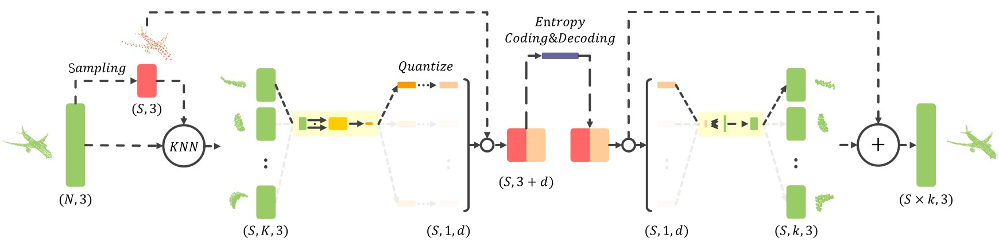

# Patch-Based Deep Autoencoder for Point Cloud Geometry Compression



## Overview

The ever-increasing 3D application makes the point cloud compression unprecedentedly important and needed. In this paper, we propose a patch-based compression process using deep learning, focusing on the lossy point cloud geometry compression. Unlike existing point cloud compression networks, which apply feature extraction and reconstruction on the entire point cloud, we divide the point cloud into patches and compress each patch independently. In the decoding process, we finally assemble the decompressed patches into a complete point cloud. In addition, we train our network by a patch-to-patch criterion, i.e., use the local reconstruction loss for optimization, to approximate the global reconstruction optimality. Our method outperforms the state-of-the-art in terms of rate-distortion performance, especially at low bitrates. Moreover, the compression process we proposed can guarantee to generate the same number of points as the input. The network model of this method can be easily applied to other point cloud reconstruction problems, such as upsampling.

## Environment

Python 3.9.6 and Pytorch 1.9.0

**Other dependencies:**

pytorch3d 0.5.0 for KNN and chamfer loss:	https://github.com/facebookresearch/pytorch3d

geo_dist for point to plane evaluation:	https://github.com/mauriceqch/geo_dist

<small>*For some unexpected reasons, we have rewritten the experimental code using a different environment and dependencies than in the paper. The training parameters and experimental results may be slightly different.</small>

## Data Preparation

You need ModelNet40 and ShapeNet to reproduce our results. The following steps will show you a general way to prepare point clouds in our experiment.

**ModelNet40**

1. Download the ModelNet40 data: [http://modelnet.cs.princeton.edu](http://modelnet.cs.princeton.edu)

2. Convert CAD models(.off) to point clouds(.ply) by using `sample_modelnet.py`:

   ```
   python ./sample_modelnet.py ./data/ModelNet40 ./data/ModelNet40_pc_8192 --n_point 8192
   ```

**ShapeNet**

1. Download the ShapeNet data [here](https://shapenet.cs.stanford.edu/media/shapenetcore_partanno_segmentation_benchmark_v0_normal.zip)

2. Sampling point clouds by using `sample_shapenet.py`:

   ```
   python ./sample_shapenet.py ./data/shapenetcore_partanno_segmentation_benchmark_v0_normal ./data/ShapeNet_pc_2048 --n_point 2048
   ```

## Training

We use `train_ae.py` to train an autoencoder on ModelNet40 dataset:

```
python ./train_ae.py './data/ModelNet40_pc_8192/**/train/*.ply' './model/trained_128_16' --N 8192 --ALPHA 2 --K 128 --d 16
```

📢 We uploaded our trained models at: [Google Drive](https://drive.google.com/file/d/1NGVwLz3Hniq1AEYFY7HZpAL0TW0J6gxb/view?usp=sharing)

## Compression and Decompression

We use `compress.py` and `decompress.py` to perform compress on point clouds using our trained autoencoder. Take the compression of ModelNet40 as an example:

```
python ./compress.py './model/trained_128_16' './data/ModelNet40_pc_8192/**/test/*.ply' './data/ModelNet40_pc_8192_compressed_128_16' --ALPHA 2
```

```
python ./decompress.py './model/trained_128_16' './data/ModelNet40_pc_8192_compressed_128_16' './data/ModelNet40_pc_8192_decompressed_128_16'
```

🤗 Tip for TMC13 compression: Since the point clouds we generated are in the coordinate range of [0, 1], which cannot be directly handled by TMC13 software. You can rescale the point cloud into a bigger scale, for example, [0, 64], before input into the TMC13.

## Evaluation

The Evaluation process uses the same software `geo_dist` as in [Quach's code](https://github.com/mauriceqch/pcc_geo_cnn). We use `eval.py` to measure reconstruction quality and check the bitrate of the compressed file.

```
python ./eval.py ../geo_dist/build/pc_error './data/ModelNet40_pc_8192/**/test/*.ply' './data/ModelNet40_pc_8192_compressed_128_16' './data/ModelNet40_pc_8192_decompressed_128_16' './eval/ModelNet40_128_16.csv'
```

## Citation

```
@incollection{you2021patch,
  title={Patch-Based Deep Autoencoder for Point Cloud Geometry Compression},
  author={You, Kang and Gao, Pan},
  booktitle={ACM Multimedia Asia},
  pages={1--7},
  year={2021}
}
```


